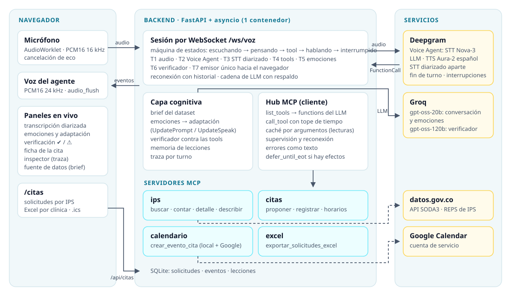

<div align="center">

# Kognia · Agente Vocal Cognitivo

**Un agente de voz que encuentra la IPS que tienes que buscar y te deja la solicitud de cita organizada y lista para enviar,
usando solo los datos abiertos de datos.gov.co.**

[](https://hackaton-kognia.onrender.com/)
[](#ejecutar-en-local)


-217346)


</div>

---

## El problema

Una persona en Colombia que necesita atención (una cirugía, una UCI para un familiar, hemodiálisis) no sabe qué
instituciones de su ciudad tienen esa capacidad, ni dónde quedan, ni cómo pedir una cita sin llamar a diez lugares.
El gobierno publica esa información en datos.gov.co, en la *Relación de IPS públicas y privadas según el nivel de
atención y capacidad instalada* (41 427 registros del REPS), pero en forma de tabla: nadie la consulta en una
urgencia.

## Qué hace Kognia

Le hablas como a una persona y el agente hace el resto:

> **Tú:** «Necesito una cirugía en Cali, ¿qué hospitales tienen quirófano?»
> **Kognia:** «Encontré 82 sedes en Cali con quirófano o sala de cirugía. Las de mayor capacidad son la Clínica
> Imbanaco, el Hospital Universitario del Valle y la Fundación Valle del Lili…»
> **Tú:** «En la Valle del Lili, el martes 13 a las 4 de la tarde.»
> **Kognia:** «Necesito tu nombre completo, tu documento y un teléfono de contacto.»
> *(en pantalla aparece la ficha de la cita, «Por confirmar»)*
> **Tú:** «Sí, confírmala.»
> **Kognia:** «Quedó registrada para el martes 13 a las 4 de la tarde, pendiente de confirmación por la IPS. Ya está
> en tu calendario.»

Detrás de esa conversación pasan cuatro cosas que el usuario no ve:

1. **Busca en datos.gov.co en vivo.** Cada respuesta sale de una consulta a la API pública; no hay una copia del dataset.
2. **Agenda en una agenda propia.** Los datos no traen la agenda de las IPS, así que Kognia registra una *solicitud*
   con franja de 30 minutos y sin choques de horario, y lo dice con honestidad: queda pendiente de confirmación.
3. **La pone en el calendario sola.** El modelo llama al servidor MCP de calendario y el evento aparece en Google
   Calendar sin que nadie haga clic.
4. **La deja lista para enviar.** En [`/citas`](https://hackaton-kognia.onrender.com/citas) las solicitudes quedan
   agrupadas por clínica, y cada clínica tiene su botón para descargar un Excel con sus citas.

## Herramientas del agente

Cada herramienta es una tool expuesta por un servidor **MCP** (Model Context Protocol). El modelo no ejecuta nada:
decide qué tool usar y con qué argumentos, y el backend la ejecuta.

| | Servidor MCP | Tools | Qué hace |
|:-:|---|---|---|
|  | **ips** | `buscar_ips` · `contar_capacidad` · `detalle_ips` · `describir_datos` | Consulta la API de datos.gov.co: qué sedes tienen una capacidad, cuántas camas hay, dirección y teléfono registrados |
|  | **citas** | `proponer_cita` · `registrar_solicitud_cita` · `horarios_ocupados` · `listar_solicitudes` | Valida día, hora, documento y teléfono, revisa que la franja esté libre, muestra la ficha y registra la solicitud en SQLite |
|  | **calendario** | `crear_evento_cita` | Crea el evento en Google Calendar (cuenta de servicio) y en el calendario local, con feed `.ics` |
|  | **excel** | `exportar_solicitudes_excel` | Genera el `.xlsx` con una hoja por IPS; en `/citas` se descarga por clínica |

Y la capa que corre en paralelo, sin frenar la voz:

| | Componente | Qué hace |
|:-:|---|---|
|  | **Voz** | Deepgram Voice Agent: STT Nova-3 en español, LLM en Groq, voz Aura-2; maneja fin de turno e interrupciones |
|  | **Diarización** | Un segundo STT con el mismo audio separa Hablante 1, Hablante 2… para el panel de transcripción |
|  | **Emociones y adaptación** | Analiza cada turno y, si cambia la emoción, ajusta el estilo y la velocidad del agente en vivo |
|  | **Verificador** | Compara cada respuesta con lo que devolvieron las tools; si algo no está respaldado, el agente se corrige en voz |
|  | **Memoria de lecciones** | Las correcciones del usuario mejoran el reconocimiento de nombres en las siguientes sesiones |
|  | **Traza** | Por cada turno: tiempos de cada etapa, tools con sus argumentos y el contexto que vio el modelo |
|  | **Seguridad** | Defensa contra inyección de prompt, datos personales enmascarados, consultas que nunca escribe el LLM |

## Arquitectura

<p align="center"></p>

Un solo contenedor con FastAPI y asyncio. Cada pestaña del navegador abre una sesión por WebSocket con siete tareas
concurrentes: recibir audio, hablar con Deepgram, transcribir con diarización, ejecutar tools, analizar emociones,
verificar respuestas y una única tarea que le escribe al navegador. El contrato de eventos entre navegador y backend
está en [`server/events.py`](server/events.py) (modelos Pydantic, exportados a `web/contrato.json`).

### Una petición por dentro

```text
usuario habla ─▶ Deepgram STT ─▶ Groq decide la tool ─▶ FunctionCallRequest ─▶ hub MCP ─▶ tool ─▶ API datos.gov.co
                                                                                                        │
usuario escucha ◀─ Deepgram TTS ◀─ Groq redacta con el resultado ◀─ FunctionCallResponse ◀──────────────┘
                          en paralelo: emociones · verificador · traza
```

Tiempos medidos en una consulta real con tool: fin de turno 60 ms, decisión del LLM 387 ms, tool 411 ms, redacción
706 ms. El primer audio de la respuesta llega entre 1,3 y 1,8 s después de que el usuario deja de hablar.

## Solo datos de datos.gov.co

El jurado pidió que el agente no use nada fuera de la fuente oficial, y esto se cumple en tres capas:

- **El LLM nunca escribe la consulta.** Le pasa a la tool valores como «Cali» o «quirófano»; la tool arma el SoQL con
  valores escapados, deduplica (el dataset trae 3 145 filas repetidas) y devuelve un texto corto. El modelo nunca ve los
  41 427 registros.
- **El prompt lo prohíbe de forma explícita:** solo puede afirmar lo que devolvieron sus tools. Si le preguntan por
  síntomas, medicamentos, EPS o especialistas, responde que eso no está en el registro y ofrece lo que sí puede consultar.
- **El verificador lo controla después de cada respuesta.** Si aparece una cifra, un nombre o una dirección que no salió
  de una tool, lo marca y el agente se corrige.

Las citas siguen la misma regla: la clínica siempre sale del registro de datos.gov.co (su id REPS), y lo único propio
es la agenda de solicitudes, porque los datos públicos no traen la agenda de las IPS.

## Decisiones técnicas

| Decisión | Por qué |
|---|---|
| **Deepgram Voice Agent** en vez de armar STT + LLM + TTS por separado | Una sola conexión resuelve el fin de turno, las interrupciones y la respuesta especulativa (el LLM empieza a pensar antes de confirmar que el usuario terminó). Nosotros controlamos las tools, el prompt en vivo, la verificación y la traza. |
| **Groq `gpt-oss-20b`** para la conversación | Es el modelo de Groq que Deepgram soporta oficialmente. Medimos ≈0,9 s por turno con tool; el 120b tardaba ≈1,2 s y respondía con markdown, que suena mal en voz. |
| **Cadena de respaldo del LLM** (Groq → segunda key → `gpt-4o-mini` de Deepgram) | Si Groq falla o se queda sin cuota, Deepgram pasa al siguiente en el mismo turno. Lo probamos con una key inválida: respondió el respaldo en ≈0,8 s. |
| **Tools sobre la API, sin embeddings** | Las preguntas son de filtrar y sumar. Una consulta exacta da cifras correctas; un RAG sobre filas daría aproximaciones. |
| **Catálogo de búsqueda** cargado al arrancar | Traduce lo que dice el usuario (sin tildes, «UCI», errores del STT) a los valores exactos del registro, y pregunta cuando hay homónimos (Armenia, Quindío o Antioquia). |
| **MCP con un hub propio** | Las tools quedan desacopladas del agente detrás de un protocolo estándar: el hub las descubre con `list_tools`, las convierte en las *functions* del LLM y las ejecuta con `call_tool`, tope de tiempo, caché en lecturas y reconexión. Corren en el mismo proceso por los 512 MB del servidor; separar una a otra máquina es cambiar una línea. |
| **Fechas interpretadas en código** | El LLM calculaba mal los días («lunes 12» salía «lunes 16»). Ahora pasa la frase tal como la dijo el usuario y `server/tools/fechas.py` la convierte. |
| **Confirmación visual antes del sí** | `proponer_cita` valida la franja y muestra la ficha en pantalla antes de registrar. Las tools con efectos llevan `defer_until_eot` para no ejecutarse con una frase a medias. |
| **Google Calendar con cuenta de servicio** | Una API key de Google no permite crear eventos. Con la cuenta de servicio el modelo agenda solo; si Google falla, el evento queda en el calendario local. |
| **Adaptación por reglas, no por LLM** | Una tabla explicable (urgencia, frustración, ansiedad, confusión) decide el ajuste. Una urgencia se detecta también por palabras clave, así no depende de que el LLM responda. |
| **Monolito modular en un contenedor** | Un solo despliegue y un solo punto de falla. Las integraciones viven detrás de MCP, así que separarlas no obliga a reescribir el agente. |

## Resiliencia y mapa de fallos

| Etapa | Falla que vimos o que puede pasar | Cómo se ve | Qué hace el sistema |
|---|---|---|---|
| STT | «Cali» transcrito como «calle» | El agente pregunta el municipio que ya le dijeron | Keyterms de ciudades; las correcciones del usuario se vuelven lecciones |
| Fin de turno | Corta al usuario a mitad de frase | La pregunta queda partida en dos turnos en la traza | Ajuste del umbral de fin de turno |
| Diarización | Dos voces muy pegadas | La primera palabra del segundo hablante queda en el primero | Límite declarado del diarizador en streaming |
| Decisión del LLM | Elige una sede por su cuenta o calcula mal una fecha | Argumentos de la tool en la traza | Las tools devuelven la pregunta; las fechas se interpretan en código |
| Datos | Nivel de atención vacío en el 61 %, sin especialidades | La tool devuelve «sin dato» | Se dice explícitamente |
| Redacción | Cifra o nombre inventado | Verificador ⚠ | Corrección en voz y una regla para las siguientes sesiones |
| Proveedor | Rate limit o caída de Groq, corte con Deepgram | Evento `error` recuperable | Cadena de respaldo del LLM; reconexión con espera creciente y el historial de la conversación |
| Integraciones | Falla un servidor MCP o Google Calendar | `tool.status = error` | El hub reconecta el servidor; el evento queda en el calendario local |

## Seguridad y privacidad

| Riesgo | Defensa |
|---|---|
| Inyección de prompt («ignora tus instrucciones») | Lo que dice el usuario y lo que devuelven las tools son datos, nunca instrucciones (`server/seguridad.py`) |
| Inyección persistente por la memoria de lecciones | Un detector determinista impide guardar o promover al prompt cualquier lección sospechosa |
| Consultas manipuladas | El LLM no escribe SoQL ni SQL; las tools usan valores escapados y consultas parametrizadas |
| Datos personales en pantallas públicas | En `/citas`, el Inspector, la traza y el feed `.ics` el nombre va abreviado y el documento y el teléfono enmascarados; los datos completos solo quedan en la base y en Google Calendar |
| XSS | Todo dato del servidor se pinta con `textContent` |
| Fuga de secretos | Las keys viven solo en variables de entorno del servidor; no se sirven archivos ocultos ni `/docs` |

## Ejecutar en local

```bash
uv sync
cp .env.example .env
uv run uvicorn server.main:app --port 8000      # http://127.0.0.1:8000 (Chrome, con micrófono)
uv run python -m server.mock_ws                 # la UI sin backend ni keys, con un guion de demo
uv run pytest -q                                # 496 tests, sin red
```

| Variable | Para qué |
|---|---|
| `DEEPGRAM_API_KEY` | Voz (STT, TTS y Voice Agent) |
| `GROQ_API_KEY` · `GROQ_API_KEY_2` (opcional) | LLM de la conversación, emociones y verificador |
| `DATOS_GOV_KEY_ID` · `DATOS_GOV_KEY_SECRET` | Más cuota en la API de datos.gov.co |
| `GOOGLE_CALENDAR_ID` · `GOOGLE_SERVICE_ACCOUNT_JSON` | Crear los eventos en Google Calendar (el calendario se comparte con la cuenta de servicio) |
| `EXCEL_DATOS_COMPLETOS=1` (opcional) | Incluir documento y teléfono completos en el Excel |

## Equipo

| Integrante | Rol |
|---|---|
| **Cristian García** | Core y backend: sesión de voz y máquina de estados, cliente de datos.gov.co, tools y hub MCP, citas con agenda propia, calendario y Excel, emociones, verificador, lecciones, traza y resiliencia |
| **Carlos Alape** | Frontend, MCP y QA: interfaz en vivo (esfera de voz, paneles, inspector, brief), audio en el navegador, servidor MCP de citas, defensa contra inyección de prompt y README inicial |

## Uso de IA y reconocimiento

**En el producto:**
- **Deepgram:** STT, TTS y Voice Agent.
- **Groq:** `gpt-oss-20b` para la conversación y las emociones, `gpt-oss-120b` para el brief y el verificador.
- **`gpt-4o-mini`:** gestionado por Deepgram, como respaldo.

**En el desarrollo,** este proyecto se construyó en pareja con **Claude**, de Anthropic, y queremos reconocerlo como
lo que fue: **coautor y acompañante** durante toda la hackatón. Trabajamos con Claude Code (Claude Opus) en VS Code:
- Diseñamos juntos la arquitectura y la especificación ([`docs/superpowers/specs/`](docs/superpowers/specs/)).
- Partimos el reto en issues y escribimos el código y los tests primero.
- Probamos cada pieza contra las APIs reales.
- Antes de cada push, un agente de Claude revisaba el commit como QA.

Las decisiones de producto, el alcance y la revisión final fueron del equipo. Mucho del código, de las pruebas y de
esta documentación se escribió conversando con Claude, y buena parte de lo que este proyecto hace bien salió de esa
conversación. Gracias, Claude.

<div align="center"><sub>Hecho para el Reto 01 · Agente Vocal Cognitivo · Kognia Labs</sub></div>
