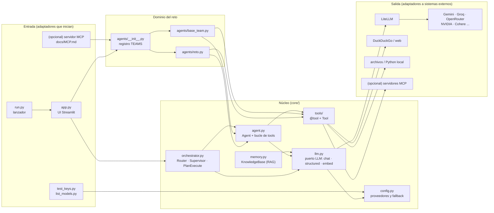
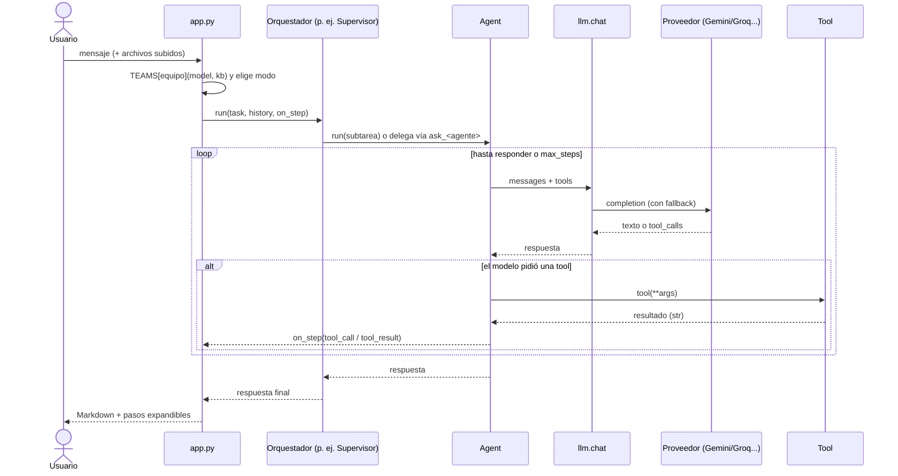

# Arquitectura de Kognia

## Resumen

Kognia es una **arquitectura por capas, modular y extensible por registro**. Toma ideas de la
arquitectura hexagonal (puertos y adaptadores), pero sin formalizarla con interfaces explícitas, porque
en una hackatón cada capa extra cuesta tiempo. La regla principal es que **las dependencias apuntan hacia
el núcleo**: la UI conoce a los agentes y los agentes conocen al núcleo, pero el núcleo no conoce a nadie.



## Capas y responsabilidades

| Capa | Archivos | Responsabilidad | Puede importar |
|---|---|---|---|
| **Entrada** | `app.py`, `run.py`, scripts | Recibir peticiones y mostrar resultados. Sin lógica de negocio. | `agents`, `core` |
| **Dominio del reto** | `agents/` | Qué agentes existen, sus instrucciones y sus tools. Es lo que cambia en cada reto. | `core` |
| **Núcleo** | `core/` | Mecánica reutilizable: hablar con modelos, bucle de agente, orquestación, RAG y tools genéricas. | solo librerías externas |
| **Salida** | LiteLLM, APIs y archivos | Sistemas externos, siempre detrás de un módulo del núcleo. | — |

## Contratos (los "puertos")

En Python estos contratos se cumplen por *duck typing*: no hay clases base obligatorias, basta con
respetar la forma.

### 1. Puerto LLM: `core/llm.py`
Es la **única** puerta hacia los modelos.

| Función | Uso |
|---|---|
| `chat(messages, model=None, tools=None, **kw)` | Respuesta cruda en formato OpenAI. Con fallback. |
| `ask(prompt, system=None, model=None)` | Atajo: texto de entrada, texto de salida. |
| `stream(messages, model=None)` | Generador de trozos de texto. |
| `structured(prompt, Schema, model=None)` | Instancia Pydantic validada. Reintenta si el JSON es inválido. |
| `embed(texts)` | Matriz numpy normalizada (para similitud coseno). |

Dentro de `chat`: se arma la cadena `modelo pedido → FALLBACK_MODELS`, se descartan los proveedores
sin key, los modelos con rate limit pasan al final mientras dura su enfriamiento, y cada fallo pasa al
siguiente modelo sin reintentos internos.

### 2. Ejecutor (`Agent`, `Router`, `Supervisor`, `PlanExecute`)
```python
name: str
def run(self, task: str, history: list[dict] | None = None, on_step: OnStep = None) -> str
```
Cualquier objeto con esta forma se puede usar desde la UI o anidar dentro de otro. `on_step` recibe
eventos `Step(agent, kind, content)`, donde `kind` es `info`, `tool_call`, `tool_result`, `answer` o
`error`. Así se muestra el progreso sin acoplar el núcleo a Streamlit.

### 3. Tool: `core/tools/__init__.py`
```python
@dataclass
class Tool:
    name: str; description: str; fn: Callable; parameters: dict  # JSON Schema
```
Se crea con `@tool` sobre una función tipada. Un agente puede envolverse como tool (`agent.as_tool()`), y
así funciona el Supervisor. La base de conocimiento también (`kb.as_tool()`) y un servidor MCP también
(`docs/MCP.md`): **todo lo que el modelo puede invocar acaba siendo un `Tool`.**

### 4. Equipo: `agents/*.py`
```python
def mi_equipo(model: str | None = None, kb: KnowledgeBase | None = None) -> list[Agent]
```
Se registra en `TEAMS`. La UI lo instancia en cada interacción con el modelo y la base de conocimiento
de la sesión.

## Flujo de una petición



## Patrones de diseño usados

| Patrón | Dónde | Para qué |
|---|---|---|
| **Adaptador / Fachada** | `core/llm.py` sobre LiteLLM | Aislar a los agentes de cada proveedor. |
| **Cadena de responsabilidad** | fallback en `llm.chat` | Si un modelo falla, lo intenta el siguiente. |
| **Circuit breaker** (simple) | `_cooldown` en `llm.py` | No insistir con un modelo sin cuota. |
| **Strategy** | orquestadores intercambiables | Cambiar de modo sin tocar la UI. |
| **Composite** | `Agent.as_tool()` | Agentes que usan agentes. |
| **Registry / Plugin** | `TEAMS`, `PROVIDERS`, `@tool` | Extender sin modificar el núcleo. |
| **Observer** | callback `on_step` | Progreso en vivo sin acoplar el núcleo a la UI. |

## Decisiones y sus porqués

- **LiteLLM en lugar de SDKs por proveedor:** un solo formato (el de OpenAI) para todos, así que el
  fallback y las tools funcionan igual con cualquier modelo.
- **`structured` por prompt y no con el modo JSON nativo:** el modo nativo varía entre proveedores, y
  pedirlo por prompt con validación Pydantic y reintento funciona en todos.
- **Bucle de agente propio en lugar de un framework (LangChain, CrewAI...):** son unas 80 líneas
  legibles. En una hackatón importa entenderlo y modificarlo rápido.
- **RAG en memoria con numpy:** sin servidor de base de datos. Si no hay embeddings, pasa a búsqueda
  por palabras clave.
- **`run.py` como lanzador:** precarga LiteLLM para evitar un deadlock de imports entre hilos de
  Streamlit, que en WSL es frecuente.

## Límites conocidos (y cómo evolucionar)

| Límite actual | Impacto | Evolución si el proyecto crece |
|---|---|---|
| Llamadas síncronas | Un usuario a la vez por proceso | `litellm.acompletion` y orquestadores `async` |
| La base de conocimiento vive en la sesión | Se pierde al reiniciar y no se comparte | `KnowledgeBase` con Chroma o pgvector, misma interfaz `add_file` / `search` / `as_tool` |
| `_cooldown` y la configuración son globales del proceso | No sirve para varias réplicas | Redis o el `Router` de LiteLLM |
| Puertos implícitos | Más difícil de mockear en tests | `typing.Protocol` para `LLMPort` y `KnowledgeBasePort`, inyectados en `Agent` |
| `run_python` sin sandbox | Inseguro con usuarios externos | Contenedor efímero o un servicio tipo E2B |
| UI solo en Streamlit | No se puede integrar con otros sistemas | FastAPI en `api/` llamando a los mismos ejecutores, o servidor MCP (`docs/MCP.md`) |

Ninguno de estos cambios exige reescribir: como los contratos ya separan las responsabilidades, cada
evolución reemplaza un módulo y conserva su interfaz.
